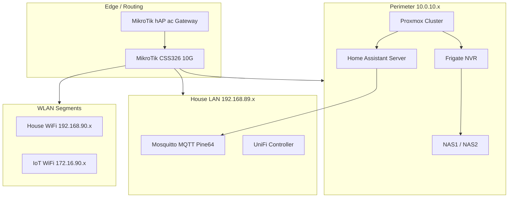

# Infrastructure & Home Lab

[← Back to Main Portfolio](../README.md)

## Overview

Hands-on infrastructure work that demonstrates bare-metal and edge realities alongside cloud-scale architecture experience. The home lab is a recycle-first, production-faithful environment: segmented networking, localized AI inference, NVR pipelines, and automation logic without standing cloud cost.

**Primary repository:** [My-Futuristic-Home](https://github.com/zlatko-lakisic/My-Futuristic-Home)

---

## Design Principles

### Local data autonomy

Surveillance, automation state, and AI inference run on owned hardware. External APIs are optional accelerators, not dependencies.

### Network segregation

High-bandwidth server and NVR traffic is isolated from household LAN and IoT WLAN segments. Perimeter, house, and IoT subnets each carry distinct trust boundaries.

### Recycle-first compute

Repurposed nodes (Beelink EQ14, Pine64 MQTT broker, legacy i7 automation host) form a cohesive cluster rather than disposable cloud sandboxes.

---

## Topology

---

## Physical & Compute Environment

All core equipment sits in a **9U wall-mount rack** with active cooling and cable management.

| Layer | Components | Role |
|---|---|---|
| **Routing** | MikroTik hAP ac, CSS326 (10G SFP+) | Gateway, perimeter switching, backbone |
| **Compute** | Beelink EQ14, Proxmox cluster, i7-7700T HA host | VMs, LXCs, automation engine |
| **Edge services** | Traefik, UniFi controller, mDNS repeater | Ingress, WiFi management, cross-subnet discovery |
| **Storage** | NAS1, NAS2 (10GbE) | NVR recordings, backups, media |
| **Auxiliary** | Pine64 MQTT, PoE injectors, patch panels | Messaging, AP/IoT power, house termination |

Detailed rack elevation, hardware inventory, and Proxmox VM/LXC strategy → [My-Futuristic-Home/infrastructure](https://github.com/zlatko-lakisic/My-Futuristic-Home/tree/main/infrastructure)

---

## AI & Surveillance Stack

| Service | Function | Notes |
|---|---|---|
| **Frigate NVR** | Object detection, stream management | Primary AI detection; TensorRT on NVIDIA RTX A4000 |
| **CodeProject.AI** | Dedicated inference (object/face/ALPR) | Complements Frigate; see [Local AI deep-dive](./Local-AI-MCP.md) |
| **Home Assistant** | Automation orchestration | Core logic engine across subnets |
| **Mosquitto MQTT** | Device messaging | Pine64 broker on house LAN |

Camera inventory, stream paths, and NVR configuration → [My-Futuristic-Home/infrastructure](https://github.com/zlatko-lakisic/My-Futuristic-Home/tree/main/infrastructure)

---

## Networking & Security

### Subnet strategy

| Segment | CIDR | Purpose |
|---|---|---|
| Perimeter | 10.0.10.x | Server management, storage, surveillance |
| House LAN | 192.168.89.x | Wired devices, APs, MQTT |
| House WLAN | 192.168.90.x | General WiFi clients |
| IoT WLAN | 172.16.90.x | Isolated IoT WiFi |

### Patterns applied

- **VLAN segregation** — Server/NVR traffic does not contend with household operations.
- **mDNS repeater** — Cross-subnet discovery for media and IoT without flattening security zones.
- **Traefik edge proxy** — Centralized ingress, TLS termination, certificate distribution.
- **MSN switch watchdogs** — Automated power-cycle logic for resilient edge switching.

Full networking documentation → [My-Futuristic-Home/infrastructure/networking.md](https://github.com/zlatko-lakisic/My-Futuristic-Home/blob/main/infrastructure/networking.md)

---

## Telemetry & Automation

Environmental and hardware telemetry feed Home Assistant automations:

- Sensor-driven environmental logic (climate, presence, security states).
- NVR events triggering household automations and notifications.
- Hardware health awareness via infrastructure monitoring patterns.

The goal is **predictive infrastructure behavior** — the same operational mindset applied at Verizon scale (uptime, resilience layers, segmented trust) expressed in a controlled local environment.

---

## Kubernetes & Sandbox Clusters

Custom Kubernetes clusters on bare-metal hypervisors provide a zero-standing-cost environment to test containerized tools, agentic workflows, and SDK integrations before recommending patterns to enterprise clients.

This mirrors the recycle-first philosophy: legacy hardware becomes a high-availability sandbox instead of e-waste.

---

## Key Outcomes

| Outcome | How it demonstrates capability |
|---|---|
| **99.999% design thinking** | Multi-tier resilience patterns practiced locally before prescribing them to healthcare clients |
| **Edge AI operations** | Frigate + CodeProject.AI + Ollama form an integrated inference pipeline |
| **Integration discipline** | MCP and MQTT boundaries match enterprise API-gateway thinking |
| **Documentation as architecture** | Repository structure (`/infrastructure`, `/services`, `/storage`) is the system diagram |

---

[← Back to Main Portfolio](../README.md) · [Local AI & MCP Architecture](./Local-AI-MCP.md)
