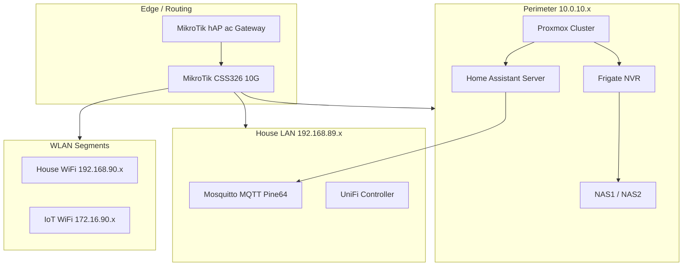

# Infrastructure & Home Lab

[← Back to Main Portfolio](../README.md)

## Overview

Hands-on infrastructure work that demonstrates bare-metal and edge realities alongside cloud-scale architecture experience. The home lab is a recycle-first, production-faithful environment built on a **VLAN isolation strategy**, **maximizing hardware density** on repurposed nodes, and localized AI inference without standing cloud cost.

**Primary repository:** [My-Futuristic-Home](https://github.com/zlatko-lakisic/My-Futuristic-Home)

---

## Design Principles

### Local data autonomy

Surveillance, automation state, and AI inference run on owned hardware. External APIs are optional accelerators, not dependencies.

### Network segregation

**VLAN isolation strategy** — high-bandwidth server and NVR traffic is isolated from household LAN and IoT WLAN segments. Perimeter, house, and IoT subnets each carry distinct trust boundaries.

### Recycle-first compute

**Maximizing hardware density** — repurposed nodes (Beelink EQ14, Pine64 MQTT broker, legacy i7 automation host) form a cohesive cluster rather than disposable cloud sandboxes.

---

## Topology

---

## Physical & Compute Environment

**Maximizing hardware density** in a **9U wall-mount rack** with active cooling and cable management — every U assigned to routing, compute, storage, or edge services.

| Layer | Components | Role |
| :-- | :-- | :-- |
| **Routing** | MikroTik hAP ac, CSS326 (10G SFP+) | Gateway, perimeter switching, backbone |
| **Compute** | Beelink EQ14, Proxmox cluster, i7-7700T HA host | VMs, LXCs, automation engine |
| **Edge services** | Traefik, UniFi controller, mDNS repeater | Ingress, WiFi management, cross-subnet discovery |
| **Storage** | NAS1, NAS2 (10GbE) | NVR recordings, backups, media |
| **Auxiliary** | Pine64 MQTT, PoE injectors, patch panels | Messaging, AP/IoT power, house termination |

Detailed rack elevation, hardware inventory, and Proxmox VM/LXC strategy → [My-Futuristic-Home/infrastructure](https://github.com/zlatko-lakisic/My-Futuristic-Home/tree/main/infrastructure)

---

## AI & Surveillance Stack

| Service | Function | Notes |
| :-- | :-- | :-- |
| **Frigate NVR** | Object detection, stream management | Primary AI detection; TensorRT on NVIDIA RTX A4000 |
| **CodeProject.AI** | Dedicated inference (object/face/ALPR) | Complements Frigate; see [Local AI deep-dive](./Local-AI-MCP.md) |
| **Home Assistant** | Automation orchestration | Core logic engine across subnets |
| **Mosquitto MQTT** | Device messaging | Pine64 broker on house LAN |

Camera inventory, stream paths, and NVR configuration → [My-Futuristic-Home/infrastructure](https://github.com/zlatko-lakisic/My-Futuristic-Home/tree/main/infrastructure)

---

## Network Segregation Strategy

**VLAN isolation strategy** applied at enterprise scale: enterprise networks fail when everything shares one flat broadcast domain. The home lab uses the same **secure-by-default** principle — trust zones are explicit, ingress is controlled, and compromised IoT devices cannot reach hypervisors, storage, or inference workloads.

### VLAN design philosophy

| Zone | CIDR | Trust level | What lives here |
| :-- | :-- | :-- | :-- |
| **Perimeter** | 10.0.10.x | Highest | Proxmox hypervisors, NAS, Frigate NVR, Home Assistant server, AI inference hosts |
| **House LAN** | 192.168.89.x | Medium | Wired endpoints, UniFi controller, Mosquitto MQTT broker, management interfaces |
| **House WLAN** | 192.168.90.x | Medium-low | Personal devices, media clients, general WiFi |
| **IoT WLAN** | 172.16.90.x | Lowest | Smart lighting, sensors, consumer IoT — no route to perimeter workloads |

**Why this matters for enterprise audiences:** The perimeter zone carries the same class of assets as a corporate DMZ + production subnet — virtualization hosts, model inference, and authoritative data stores. IoT WLAN is treated like a vendor-managed device network or OT segment: useful, untrusted, and firewalled from core compute. That is the same mindset applied when separating Baxter resilience layers from hospital OT, or isolating warehouse telematics from corporate ERP integrations.

### IoT isolation from core compute

Insecure or firmware-stale IoT devices (smart switches, environmental sensors, Zigbee/Z-Wave mesh endpoints) never share a L2 domain with Proxmox clusters or Ollama inference hosts. Cross-subnet automation still works — Home Assistant orchestrates across zones — but **lateral movement from a compromised bulb to an AI model is architecturally blocked**, not merely discouraged.

MikroTik RouterOS enforces inter-VLAN policy at the gateway; the CSS326 10G backbone carries tagged traffic without blurring segments. mDNS repeaters provide discovery for media and IoT where needed, without flattening the security model.

### Routing and edge controls

- **MikroTik hAP ac** — Primary gateway; inter-VLAN firewall rules and NAT boundaries.
- **MikroTik CSS326** — 10G SFP+ perimeter switching; server and NVR traffic isolated from house LAN contention.
- **Traefik edge proxy** — Centralized ingress, TLS termination, and certificate distribution for services that must be reached deliberately.
- **MSN switch watchdogs** — Automated power-cycle logic for resilient edge switching.
- **UniFi + PoE injectors** — SSID-to-VLAN mapping keeps IoT WLAN clients off house and perimeter segments by default.

Full VLAN rules, subnet diagrams, and NAS2 bridge configuration → [My-Futuristic-Home/infrastructure/networking.md](https://github.com/zlatko-lakisic/My-Futuristic-Home/blob/main/infrastructure/networking.md)

---

## Telemetry & Automation

Environmental and hardware telemetry feed Home Assistant automations:

- Sensor-driven environmental logic (climate, presence, security states).
- NVR events triggering household automations and notifications.
- Hardware health awareness via infrastructure monitoring patterns.

The goal is **predictive infrastructure behavior** — the same operational mindset applied at Verizon scale (uptime, resilience layers, segmented trust) expressed in a controlled local environment.

---

## Kubernetes & Sandbox Clusters

**Bare-metal hypervisors** host custom Kubernetes clusters that **maximize hardware density** — a zero-standing-cost environment to test containerized tools, agentic workflows, and SDK integrations before recommending patterns to enterprise clients.

This mirrors the recycle-first philosophy: legacy hardware becomes a high-availability sandbox instead of e-waste.

---

## Key Outcomes

| Outcome | How it demonstrates capability |
| :-- | :-- |
| **99.999% design thinking** | Multi-tier resilience patterns practiced locally before prescribing them to healthcare clients |
| **Edge AI operations** | Frigate + CodeProject.AI + Ollama form an integrated inference pipeline |
| **Integration discipline** | MCP and MQTT boundaries match enterprise API-gateway thinking |
| **Documentation as architecture** | Repository structure (`/infrastructure`, `/services`, `/storage`) is the system diagram |

---

[← Back to Main Portfolio](../README.md) · [Local AI & MCP Architecture](./Local-AI-MCP.md)
