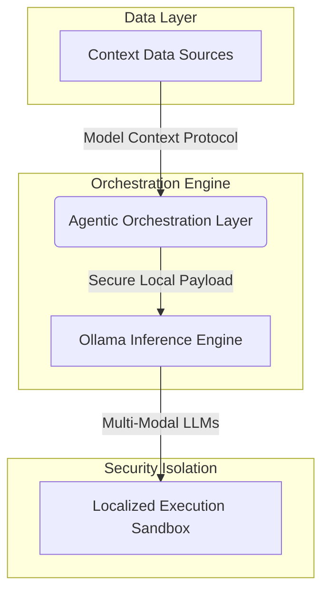
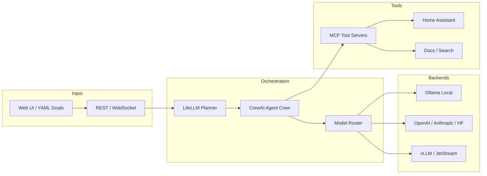

# Local AI & MCP Architecture

[← Back to Main Portfolio](../index.md)

## Why MCP Matters

Model Context Protocol (MCP) standardizes how AI agents discover and invoke tools — the same integration problem enterprise architects have solved with API gateways and ESBs, now applied to agentic workflows. Without a protocol boundary, every agent hard-codes tool integrations; with MCP, tools become pluggable services with explicit capability contracts.

For organizations evaluating AI automation, MCP provides:

- **Composability** — add Home Assistant, documentation search, or internal APIs without rewriting agent logic
- **Governance surface** — credential-scoped catalogs mirror enterprise service registries
- **Vendor portability** — swap Ollama for cloud models while keeping the same tool layer
- **Auditability** — structured request/response flows instead of opaque prompt stuffing

---

## Enterprise Use Cases

| Use case | MCP role | Enterprise parallel |
| :-- | :-- | :-- |
| **Operational automation** | Agents invoke Home Assistant, MQTT, or internal REST APIs via MCP servers | Integration bus connecting line-of-business systems |
| **Knowledge retrieval** | Docs/search MCP servers feed grounded context into planners | Enterprise search and RAG pipelines |
| **Multi-step workflows** | CrewAI crews chain tool calls through a catalog | BPM/orchestration with human approval gates |
| **Vertical packs** | Domain overlays under `examples/verticals/` | Industry solution accelerators |
| **Discovery workshops** | YAML + env-var catalogs validate workflows before custom code | HLSD and POC scoping |

---

## Security Considerations

MCP introduces the same trust boundaries as any integration layer:

- **Credential scoping** — backend and tool catalogs filter by environment credentials; agents only see what operators explicitly enable
- **Network isolation** — MCP servers run in segmented subnets (see [Infrastructure VLAN design](./Infrastructure.md#network-segregation-strategy)); tool reachability is deliberate, not ambient
- **Local execution sandbox** — inference and tool execution stay on owned hardware for privacy-sensitive workloads
- **Least privilege** — each MCP server exposes a narrow capability set rather than blanket system access
- **Human-in-the-loop** — high-impact actions remain gated by operator approval in production-shaped workflows

Enterprise deployments should treat MCP servers like microservices: authenticated endpoints, segmented networks, and logged invocation trails.

---

## Local vs Cloud MCP

| Dimension | Local MCP (this portfolio) | Cloud-hosted MCP |
| :-- | :-- | :-- |
| **Data sovereignty** | Telemetry, video, and automation state stay on owned hardware | Data crosses provider boundaries |
| **Latency** | Sub-second tool round-trips on LAN | Depends on WAN and provider region |
| **Cost model** | Recycle-first bare-metal; no per-token egress surprises | Usage-based billing at scale |
| **Model choice** | Ollama, vLLM, JetStream on local GPU/TPU | Managed APIs (OpenAI, Anthropic, etc.) |
| **Best fit** | Edge AI, home-lab validation, regulated or air-gapped patterns | Burst capacity, frontier models, global teams |

The [agentic-orchestration](https://github.com/zlatko-lakisic/agentic-orchestration) stack supports **both** — local backends by default, commercial APIs when credentials and latency profiles justify them.

---

## Lessons Learned

| Lesson | Detail |
| :-- | :-- |
| **Catalog before code** | YAML workflows and env-var backend catalogs reduce POC friction more than bespoke planner glue |
| **Separate planning from execution** | LiteLLM planner + CrewAI crew mirrors enterprise separation of orchestration and worker services |
| **VRAM-aware routing** | Smaller models for planning steps; reserve large models for synthesis — directly reduces hardware spend |
| **MCP is the integration hub** | Resist one-off tool imports; every new capability should register as an MCP server |
| **Pressure-test locally** | Patterns validated on Proxmox clusters translate to client recommendations with real utilization data |
| **Feedback loops matter** | Session history and learning loops in the orchestrator mirror enterprise voice-of-customer pipelines |

---

## Overview

*Standard MCP request/response flow: the client translates AI requests into protocol format; servers fetch from external data sources and return structured context.*

This deep-dive covers self-hosted AI systems that extend enterprise integration thinking into edge inference: model-agnostic orchestration, multi-modal vision pipelines, and MCP tool servers that connect agents to real environments (Home Assistant, documentation, search, and custom catalogs).

Primary repositories:

- [agentic-orchestration](https://github.com/zlatko-lakisic/agentic-orchestration)
- [CodeProjectAI-OmegaOllamaMLLM](https://github.com/zlatko-lakisic/CodeProjectAI-OmegaOllamaMLLM)

---

## System Architecture

### Conceptual MCP flow

How context moves from data sources through MCP into local execution — the pattern this repository implements end to end.

### Orchestration blueprint

Detailed component flow across planning, model routing, backends, and MCP tool servers.

The orchestration layer separates **planning** (which model and which steps) from **execution** (agent roles and tool calls). MCP servers act as the integration boundary — the same pattern as REST API adapters in enterprise architecture, applied to agent tooling.

---

## Agentic Orchestration

**Repository:** [github.com/zlatko-lakisic/agentic-orchestration](https://github.com/zlatko-lakisic/agentic-orchestration)

### Architectural blueprint

- Natural-language goals and YAML workflows drive coordinated multi-agent crews.
- A LiteLLM-backed planner selects backends per task from a catalog filtered by credentials and hardware capability (CPU, GPU, TPU, VRAM heuristics).
- Optional MCP servers extend agents without hard-coding tool integrations.
- Vertical overlays under `examples/verticals/` add domain-specific orchestrator context without forking core engine code.

### Tech stack

| Layer | Components |
| :-- | :-- |
| **Orchestration** | CrewAI, YAML workflow definitions, dynamic planning modes |
| **Model routing** | Ollama, OpenAI-compatible APIs, Anthropic Claude, Hugging Face, vLLM, JetStream |
| **Tooling** | Model Context Protocol (MCP) catalog, Home Assistant, docs/search servers |
| **Interfaces** | CLI tool package, Web UI with local WebSockets, session and learning loops |

### Key outcomes

- **Vendor agnosticism** — Teams adopt on top of existing models, credentials, and MCP tools, then blend commercial APIs when faster or good enough.
- **Short path to POC** — Catalog-driven configuration via environment variables instead of bespoke planner and tool glue.
- **Production-shaped patterns** — Knowledge base, learning loop, VRAM-aware routing, and vertical overlays mirror how enterprise platforms ship domain packs.

### Design lessons

| Challenge | Approach |
| :-- | :-- |
| **Latency on local hardware** | Per-task backend selection with VRAM heuristics; prefer smaller models for planning steps |
| **Context window limits** | Session management and knowledge-base retrieval instead of stuffing full history into prompts |
| **Tool sprawl** | MCP catalog as integration hub — same role as an API gateway in distributed systems |
| **Proof-of-concept friction** | YAML + env-var catalogs so teams validate workflows before committing to custom code |

---

## Multi-Modal LLM Integration (CodeProject.AI)

**Repository:** [github.com/zlatko-lakisic/CodeProjectAI-OmegaOllamaMLLM](https://github.com/zlatko-lakisic/CodeProjectAI-OmegaOllamaMLLM)

### Architectural blueprint

Plugin for [CodeProject.AI Server](https://www.codeproject.com/ai/) that routes image and video analysis through **Ollama** vision models. Video is handled via frame sampling and summarization rather than sending full streams to the model.

### Tech stack

Ollama · CodeProject.AI module pipeline · Moondream (default vision model) · containerized execution

### Key outcomes

- Self-hosted multi-modal inferencing inside an existing edge-AI server boundary.
- Data stays local — aligned with privacy-sensitive workloads in enterprise and home-lab contexts.
- Composable with the broader home infrastructure stack documented in [Infrastructure & Home Lab](./Infrastructure.md).

---

## Relationship to Enterprise Work

| Enterprise pattern | Local AI equivalent |
| :-- | :-- |
| API gateway / integration bus | MCP catalog and model router |
| Credential-scoped service catalog | Backend catalog filtered by env credentials |
| HLSD and discovery artifacts | YAML workflows and vertical overlays |
| Feedback loop to product roadmap | Learning loop and session history in orchestrator |

The same architectural instincts — bounded integrations, catalog-driven adoption, outcome-first scoping — apply whether the deployment target is a Fortune 500 private network or a Proxmox cluster in a home lab.

---

[← Back to Main Portfolio](../index.md) · [Infrastructure & Home Lab](./Infrastructure.md)
