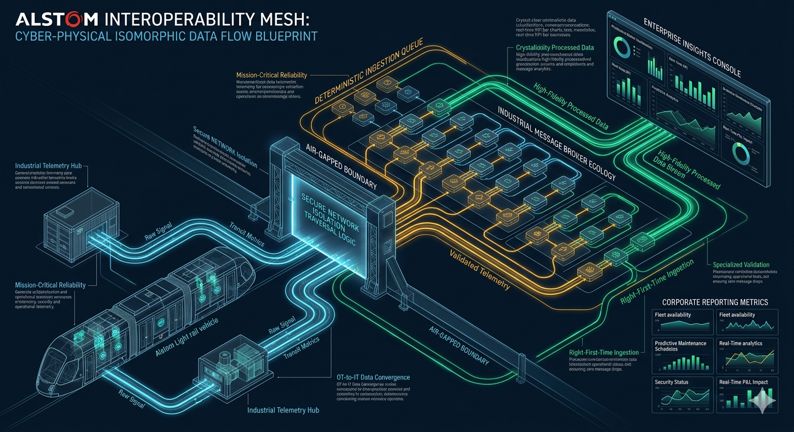
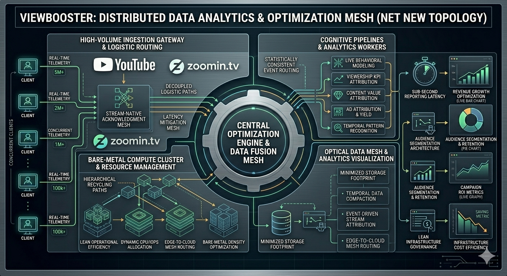

# Architecture Case Studies

[← Back to Main Portfolio](./index.md)

LinkedIn project highlights expanded into architecture case studies. Each narrative follows the same structure used in enterprise architecture reviews:

| Lens | What it answers |
| :-- | :-- |
| **Business problem** | Why the initiative existed and what was at stake |
| **Constraints** | Scale, regulation, legacy debt, uptime, or organizational boundaries |
| **Architecture** | Integration patterns, data flows, and platform decisions |
| **Tradeoffs** | What was sacrificed or deferred — and why |
| **Outcome** | Measurable business or operational impact |

Full catalog from [LinkedIn](https://www.linkedin.com/in/zlatko-lakisic/details/projects/).

---

<h2 id="omega-cms">Omega CMS — Enterprise Content Architecture & Localization</h2>

**Jan 2017 – Present** · [omegacms.io](https://omegacms.io) · [GitHub](https://github.com/zlatko-lakisic/omegacms)

OmegaCMS was engineered as a high-performance, enterprise-grade content management framework designed to decouple content delivery from core business logic. Built to replace rigid, monolithic legacy architectures, the platform established a highly scalable, multi-tenant environment capable of serving dynamic, localized content across global digital properties with ultra-low latency and absolute technical governance. It reads and integrates data from multiple systems, runs on existing infrastructure or as a serverless service, and helps organizations manage content with very little overhead.

### The challenge

Prior to implementation, content distribution suffered from severe infrastructure bottlenecks:

- **Monolithic lock-in** — Content changes required full application deployment cycles, introducing operational risk and stalling time-to-market for digital campaigns.
- **Localization friction** — Managing content across multiple regions and languages forced teams to maintain separate, siloed application instances, resulting in massive configuration drift.
- **Performance degradation** — High-traffic spikes routinely threatened database stability due to a lack of an optimized caching and abstraction layer.

### Architectural highlights

- **Decoupled headless design** — Strict headless CMS model exposing content via robust, secure REST API layers (plus client libraries in C#, JavaScript, and TypeScript) to ensure frontend independence and cross-platform flexibility.
- **Database-agnostic data layer** — SQL Server, MySQL, Oracle, document stores, and flat-file sources through pluggable data access and federated integration.
- **Multi-tenant abstraction** — Unified localization and translation engine enabling a single codebase to serve multi-region deployments seamlessly.
- **Advanced edge caching** — High-availability caching hierarchies including reverse-proxy layers and automated cache invalidation hooks to minimize origin server load and optimize Core Web Vitals.
- **Serverless deployment** — AWS Lambda, Azure Functions, and Google Cloud targets for bursty or globally distributed workloads.
- **Content-first modeling** — Visual content designer drives generated structures rather than page-builder lock-in.

### Business outcomes

- **Accelerated time-to-market** — Shifted content updates from engineering deployment pipelines to zero-downtime, non-technical editorial workflows.
- **Infrastructure savings** — Optimized database query layers and caching strategies, reducing operational compute overhead by maximizing hardware performance.
- **Global consistency** — Established brand and architectural governance across digital channels through a centralized, secure content repository.

### Tech stack

Headless CMS · REST APIs · multi-tenant localization · edge caching · .NET Core · federated data integration · AWS Lambda · Azure Functions · Google Cloud · SQL Server · MySQL · Oracle

### Role

Co-Founder and Solutions Architect at [Omega Content Management Services](https://www.linkedin.com/company/omega-cms). Led customer blueprinting, architecture documentation, .NET Core services, federated data integration, and AWS migration playbooks for enterprise clients.

**Deep dive** → [OmegaCMS on GitHub](https://github.com/zlatko-lakisic/omegacms) · [Technical Strategy & Career](./Technical-Strategy.md#founder--omega-it-llc-new-york-ny)

---

<h2 id="walmart-inventory-automation">Walmart Inventory Automation</h2>

**Genpact · Walmart & Sam's Club · 11/2018 – 11/2019**

Architectural strategy, re-engineering, and automation of a highly fragmented global supply chain and inventory accounting ecosystem. At enterprise scale, the initiative unified 50+ disparate legacy and modern systems into a resilient dual-mode integration bridge — replacing a brittle manual workflow built on multi-layered spreadsheet networks with a right-first-time data pipeline that secured financial fidelity for metrics directly tied to corporate P&L.

### The challenge

The baseline infrastructure was extreme technical debt in a fully siloed operating model:

- **Systemic scale** — 50+ disconnected platforms, from SAP and Salesforce to mainframe green-screen terminals, independent file shares, and legacy email data streams.
- **Geospatial gaps** — No unified mapping; logistics teams relied on static paper atlases instead of centralized GIS.
- **Spreadsheet dependency** — Frontline staff tracked inventory through a fragile Excel matrix fed by 50 individual data-dump sheets into an unstable master VLOOKUP system.
- **P&L exposure** — Inventory metrics feed corporate profit-and-loss statements; teams reran identical calculation cycles three to four times per period to manually verify integrity.

### Architectural highlights

#### 1. Dual-mode integration bridge

Orchestration layer supporting synchronous and asynchronous processing so low-performance legacy systems could not drag down modern cloud applications:

- **Synchronous streams** — Low-latency API transactions for interactive endpoints (SAP, Salesforce).
- **Asynchronous pipelines** — Stateful, queue-driven workers for bulk FTP drops, file-share exchanges, and structured email payloads without blocking upstream workflows.
- **Legacy mainframe adapters** — Custom programmatic wrappers and terminal emulators to extract and integrate siloed green-screen data layers.

#### 2. Operational discovery and workflow optimization

Before automation code shipped, ground-level technical discovery mapped undocumented manual processes and systematic failure points. Edge-case exceptions were diagnosed and proactive error-reconciliation algorithms were built into the software layer — optimizing the operational flow before automation took over.

#### 3. Cognitive document-matching mesh (3-stage HITL ML pipeline)

Physical Bills of Lading from truck drivers often arrived months — or up to a year — before corresponding vendor invoices. A Human-in-the-Loop machine learning system reconciled that temporal friction:

- **Stage 1 — Imitation learning** — Models ingested historical processing patterns to capture implicit matching heuristics used by human operators.
- **Stage 2 — Assisted inference** — Interactive suggestion layer with live operator feedback loops to continuously tune model confidence scores.
- **Stage 3 — Autonomous execution** — Full autonomy with human operators out of the active loop except for randomized QA and statistical sanity checks.

### Business outcomes

- **Spreadsheet eradication** — Eliminated the manual 50-tab Excel ecosystem and its performance lags and corruption vectors.
- **Right-first-time fidelity** — Automated validation delivered reliable metrics on the first run, removing 3×–4× operational rework cycles.
- **Supply chain visibility** — Transformed batch-oriented tracking into a continuous, event-driven data stream across 5,500 retail locations.
- **P&L integrity** — Executive leadership gained high-fidelity, near-real-time inventory assets tied to financial reporting.

### Tech stack

Event-driven architecture · synchronous/asynchronous microservices · enterprise application integration (EAI) · SAP · Salesforce API · custom mainframe terminal emulators · FTP/SFTP · applied ML · HITL pipelines · operator feedback loops · .NET · SQL Server · Sequence platform

### Role

Principal Consultant — Lead architect and delivery director. Led a team of 15 through discovery, HLSD, and deployment. Directed backend discovery architecture for the inventory automation initiative across Walmart and Sam's Club.

**Related experience** → [Technical Strategy & Career — Genpact](./Technical-Strategy.md#principal-consultant--genpact-new-york-ny)

---

<h2 id="alstom">ALSTOM — Mission-Critical Industrial Interoperability</h2>

**Green River Media · Alstom · Enterprise Integration**

This enterprise initiative focused on designing and deploying a secure, high-reliability integration layer for Alstom's transit and industrial management environments. The project bridged complex telemetry streams, industrial hardware interfaces, and core enterprise reporting systems — translating real-time field operational data into actionable business intelligence under strict security boundaries. The solution was distributed geographically across North America, South America, Europe, and Asia.

### The challenge

Operating within mission-critical infrastructure introduced intense architectural constraints:

- **Protocol fragmentation** — Forcing modern enterprise software to communicate with specialized, low-level industrial hardware and telemetric monitoring systems.
- **Zero-downtime requirements** — Because the platform handled operational infrastructure telemetry, system downtime, data loss, or message drops could lead to severe logistical and financial impacts.
- **Stringent security baselines** — Operating within heavily regulated environments required absolute network segregation, secure data access, and bulletproof audit trails.

### Architectural highlights

- **Industrial message brokerage** — Fault-tolerant integration mesh leveraging robust messaging queues and event-driven patterns to handle high-throughput telemetry streams cleanly.
- **Secure network segregation** — Strict network boundaries and unidirectional data flows, ensuring isolated operational technology (OT) zones could securely pass telemetry to enterprise information technology (IT) layers without compromising security.
- **Deterministic event processing** — Stateful, idempotent message processing workers to guarantee right-first-time data validation and zero payload loss, even during network degradation.
- **Multi-region delivery** — Global enterprise presence with continent-level deployment topology as part of a broader portfolio of implementations including Eurotunnel and Emco Wheaton (Gardner Denver).

### Business outcomes

- **Predictive operational insights** — Unlocked siloed hardware telemetry, giving stakeholders real-time visibility into systemic asset health and operational metrics.
- **Hardened security posture** — Achieved full compliance with rigorous industrial cybersecurity standards through a secure-by-default architecture.
- **Systemic interoperability** — Provided a scalable, reusable integration blueprint for connecting legacy industrial hardware to modern cloud or hybrid analytics environments.

### Tech stack

Event-driven integration · message queues · OT/IT network segregation · idempotent workers · .NET · ASP.NET · enterprise reporting interfaces

### Role

Lead Developer and later Product Director at Green River Media. Designed and implemented integration architecture, on-site client delivery, and server infrastructure for global manufacturing and infrastructure clients.

**Related experience** → [Technical Strategy & Career — Green River Media](./Technical-Strategy.md#product-director--green-river-media-london-uk)

---

<h2 id="viewbooster">Video Promotions (ViewBooster) — High-Throughput Analytics & Optimization Engine</h2>

**Zoomin.TV** · YouTube Multi-Channel Network

ViewBooster was architected as a highly available, distributed data analytics and performance optimization engine for YouTube advertising at scale. Built to handle massive streams of real-time user engagement telemetry, the platform leveraged high-density compute clustering and decoupled queue-driven processing to ingest, validate, and analyze millions of concurrent events while maintaining absolute data integrity and sub-second reporting latency. Zoomin.TV deployed it across 60,000+ channels — in minutes, a campaign could be created and placed on each video of each selected channel.

### The challenge

The platform encountered classic high-scale data engineering challenges in a live ad-tech environment:

- **Extreme write volume** — Ingesting real-time telemetry from thousands of concurrent clients and Google API statistics across millions of channels created intense write-heavy database locks and network saturation points.
- **Latency tolerances** — Aggregated analytics reports were required in near-real-time, making traditional night-run batch processing completely unviable.
- **Compute cost scaling** — Traditional cloud scaling architectures threatened exponential billing spikes if infrastructure footprints were not heavily optimized.

### Architectural highlights

- **Asynchronous ingestion mesh** — Highly resilient ingestion layer that quickly acknowledged incoming client payloads and offloaded them to message queues, decoupling public API response times from database write operations.
- **High-velocity campaign engine** — Angular and Material UI communicating with Web API services; campaigns propagated across massive channel fleets in minutes.
- **ML-driven channel matching** — Back-end Windows service matches channels to advertising campaigns and monitors click-through performance in real time.
- **Stream aggregation pipelines** — Real-time stream processing microservices to filter, deduplicate, and aggregate analytics data in-flight before committing to cold storage, drastically reducing database storage overhead.
- **High-density compute** — Recycle-first and bare-metal engineering principles applied to construct efficient hypervisor environments, maximizing CPU/IOPS throughput to avoid costly cloud resource inflation.

### Business outcomes

- **Sub-second analytics delivery** — Shifted reporting cycles from multi-hour delays to a dynamic, sub-second visibility model.
- **Massive cost optimization** — Prevented runaway cloud spend by optimizing local infrastructure densities, delivering elite-tier throughput at a fraction of standard operational costs.
- **Revenue impact** — Contributed to new revenue streams with multi-million-dollar business impact while Zoomin was among the largest YouTube MCNs globally; proprietary promotion logic for ~100,000 managed channels.

### Tech stack

C# .NET · Google APIs · message queues · stream processing · AngularJS / Angular Material · Web API · ColdFusion (merchandising interfaces) · AWS · automated campaign optimization

### Role

Director, Solutions Architecture and Head of Development. Led a global team of 27; defined platform strategy for creator monetization and merchandising revenue streams.

**Related experience** → [Technical Strategy & Career — ZoominTV](./Technical-Strategy.md#director-solutions-architecture--zoomintv-amsterdam-netherlands)

---

## Related Open-Source & Lab Projects

These active GitHub repositories extend the project work above into local AI, agent orchestration, and hands-on infrastructure — not listed separately on LinkedIn but part of the same engineering narrative.

| Project | Repository |
|---|---|
| Agentic Orchestration | [agentic-orchestration](https://github.com/zlatko-lakisic/agentic-orchestration) |
| Ollama MultiModal LLM (CodeProject.AI) | [CodeProjectAI-OmegaOllamaMLLM](https://github.com/zlatko-lakisic/CodeProjectAI-OmegaOllamaMLLM) |
| My Futuristic Home (home lab) | [My-Futuristic-Home](https://github.com/zlatko-lakisic/My-Futuristic-Home) |

---

[← Back to Main Portfolio](./index.md)
