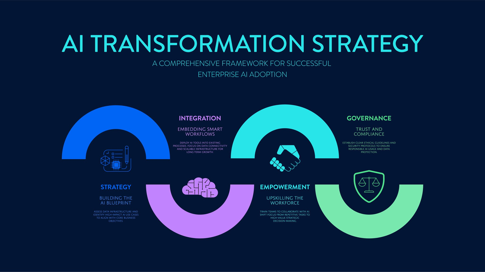

# Zlatko Lakisic

**Senior Solutions Architect · Engineering Leadership & Technical Strategy**

A highly strategic technology leader who builds resilient, outcome-first architectures and enterprise solutions. Expert in driving digital transformation, local AI ecosystems, and scalable cloud networks. Passionate about open-source innovation, recycle-first engineering, and bridging the gap between deep technical strategy and business value.

15+ years as a trusted advisor to C-suite stakeholders — from Verizon enterprise integration and healthcare private networks to national payment infrastructure and global retail automation.

  <a href="./Technical-Strategy.md"><strong>Full CV — Experience, Education, and Technical Strategy →</strong></a>

Verizon · Walmart · Zoomin.TV · The Clearing House · Omega IT LLC · 15+ years · [Recommendations](./Recommendations/README.md)

## Connect

| | |
|---|---|
| **CV / Resume** | [**Technical Strategy and Career**](./Technical-Strategy.md) — full experience, education, skills, philosophy |
| **Email** | [zlatko.lakisic@gmail.com](mailto:zlatko.lakisic@gmail.com) |
| **Phone** | 336-682-9871 |
| **LinkedIn** | [linkedin.com/in/zlatko-lakisic](https://www.linkedin.com/in/zlatko-lakisic/) |
| **GitHub** | [github.com/zlatko-lakisic](https://github.com/zlatko-lakisic) |
| **ORCID** | [0009-0004-8820-8881](https://orcid.org/0009-0004-8820-8881) |
| **Location** | New York City, NY |

## Core Pillars

### Enterprise Architecture & Digital Transformation

Outcome-first roadmaps aligned to business metrics. Legacy modernization, API integration design, technical discovery, and governance that scales across global enterprise accounts.

### Intelligent Infrastructure & Edge AI

Agentic orchestration, local multi-modal LLM workflows, and Model Context Protocol (MCP) tool layers — extending enterprise integration patterns into self-hosted, low-latency AI.

### Recycle-First Engineering

Repurposed bare-metal clusters, Proxmox hypervisors, and segmented home-lab environments that mirror production constraints without idle cloud spend.

## Featured Repositories

Live project cards — click through for architecture docs, commit history, and implementation detail.

*Model-agnostic CrewAI orchestration with MCP tool servers and Ollama backends — self-hosted multi-modal inferencing without external API dependency.*

*VLAN-segmented home lab with Frigate NVR, Home Assistant, and Proxmox workloads · Decoupled ECM platform with pluggable data access and serverless deployment targets.*

## Projects

Highlights from [LinkedIn](https://www.linkedin.com/in/zlatko-lakisic/details/projects/) — [full project catalog](./Projects.md)

| Project | Period | Summary |
|---|---|---|
| [**Omega CMS**](https://omegacms.io) | Jan 2017 – Present | Database-agnostic, headless ECM — integrates disparate data sources, runs on existing infra or serverless ([GitHub](https://github.com/zlatko-lakisic/omegacms)) |
| **ALSTOM** | Green River Media | Global Ektron enterprise site — multi-continent WebForms deployment across the Americas, Europe, and Asia |
| **Video Promotions (ViewBooster)** | Zoomin.TV | YouTube ad-tech engine for 60,000+ channels — Angular UI, ML channel matching, real-time campaign optimization |

## Technical Ecosystem

| Domain | Technologies and Frameworks |
| :-- | :-- |
| **Architecture and Integration** | REST APIs, webhooks, SSO (SAML/OAuth), enterprise discovery, HLSD, .NET |
| **Cloud and Data** | AWS, Azure, distributed systems, data pipelines, motion/telematics analytics |
| **AI and Automation** | Ollama, MCP, CrewAI, LiteLLM, Home Assistant, CodeProject.AI, Frigate |
| **Infrastructure** | Kubernetes, Docker, Proxmox VE, MikroTik RouterOS, Traefik, UniFi |
| **Methodologies** | Outcome-first delivery, technical governance, recycle-first engineering |

## Deep Dives

Engineering architecture deep dives — for career history see **[Full CV](./Technical-Strategy.md)** above.

| Document | Audience | Contents |
| :-- | :-- | :-- |
| [**Projects**](./Projects.md) | Recruiters, technical peers | LinkedIn project catalog with architecture detail and repo links |
| [**Recommendations**](./Recommendations/README.md) | Recruiters, hiring managers | Nine professional recommendations with full text |
| [**Local AI and MCP Architecture**](./Engineering/Local-AI-MCP.md) | Principal engineers, architects | Agent orchestration, multi-modal LLM integration, system design |
| [**Infrastructure and Home Lab**](./Engineering/Infrastructure.md) | Platform engineers, SREs | Proxmox topology, networking, NVR/AI stack, automation |

## Philosophy

> True technical leadership goes beyond choosing a modern stack. It requires predictable execution paths, operational sustainability, and architecture that directly moves the needle on business outcomes — whether scaling cloud integrations or optimizing local bare-metal clusters.

## Recommendations

| Recommender | Role | Highlight |
| :-- | :-- | :-- |
| [**Jon Woodland**](./Recommendations/jon-woodland.md) | Director, Technology Development and Integration, Verizon | Maps customer challenges to technology outcomes; effective with C-suite and engineers |
| [**Sam Aria**](./Recommendations/sam-aria.md) | Sr. Client Partner, Verizon Business Group | Drove Baxter healthcare private network opportunity and broader connected-hospital wins |
| [**Robin Goldsmith**](./Recommendations/robin-goldsmith.md) | Practice Leader, Healthcare and Life Sciences, Verizon Business | Go-to resource for critical projects; entrepreneurial when there is no playbook |
| [**Gert-Jan Vrolijk**](./Recommendations/gert-jan-vrolijk.md) | Director IT, Zoomin.TV | Great team leader; adapts quickly to the business side of projects |
| [**Maarten Kruit**](./Recommendations/maarten-kruit.md) | IT Coordinator, Zoomin.TV | Clear communicator, software architect, takes on challenging work |
| [**Matt Happel**](./Recommendations/matt-happel.md) | Senior Lead Full Stack Developer, Market America | Gets the job done; innovative with new concepts |
| [**Norman Graves**](./Recommendations/norman-graves.md) | Business Development Director, Green River Media | Diligent, knowledgeable, capable software engineer |
| [**Ivan Varbanov**](./Recommendations/ivan-varbanov.md) | SRE, DevOps, Cloud Infrastructure | Wide expertise instrumental to complex project delivery |
| [**Haris Šečić**](./Recommendations/haris-secic.md) | Software Developer | CEO who codes; realistic estimates plus architecture guidance |

[All recommendations →](./Recommendations/README.md)

## About This Repository

Executive dashboard for my professional portfolio. Detailed narratives live in linked markdown files.

**GitHub Pages site:** [zlatko-lakisic.github.io/portfolio](https://zlatko-lakisic.github.io/portfolio/) — styled with the Jekyll [Minimal theme](https://github.com/pages-themes/minimal) per [GitHub Pages documentation](https://docs.github.com/en/pages/setting-up-a-github-pages-site-with-jekyll/adding-a-theme-to-your-github-pages-site-using-jekyll).

## License

Copyright © 2026 Zlatko Lakisic. All Rights Reserved. See [LICENSE](LICENSE). Linked project repositories remain under their own licenses.
