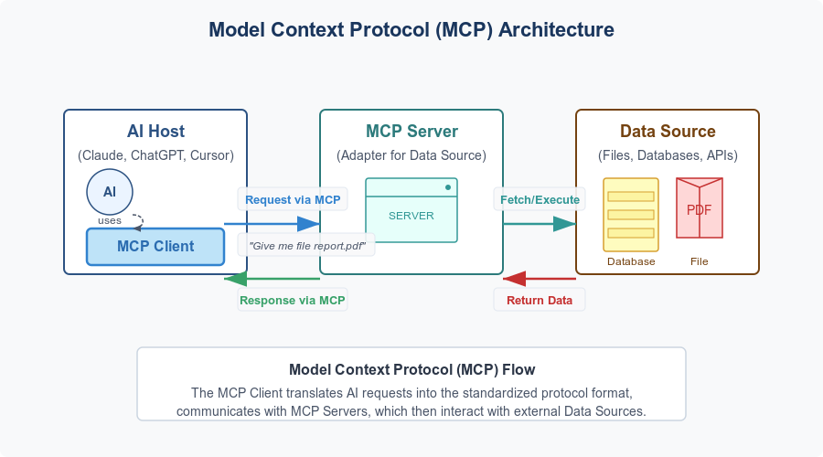

<!-- AUTO-GENERATED from index.md. Do not edit README.md directly. Run: scripts/sync-readme.ps1 -->
**Senior Solutions Architect · Engineering Leadership & Technical Strategy**

**[View formatted portfolio on GitHub Pages →](https://zlatko-lakisic.github.io/zlatko-lakisic/)** — architecture gallery, case studies, and deep dives with the Minimal theme.

<figure>

<figcaption><strong>AI Transformation Strategy framework</strong> — four pillars for enterprise AI adoption: <em>Strategy</em> (outcome-first roadmaps aligned to business metrics), <em>Integration</em> (API and MCP tool boundaries), <em>Empowerment</em> (self-hosted inference and agent workflows), and <em>Governance</em> (credential-scoped catalogs, segmented trust, and operational sustainability).</figcaption>
</figure>

## At a Glance

| Metric | Delivery |
| :-- | :-- |
| **Scale** | 50+ systems unified across **5,500** Walmart and Sam's Club locations |
| **Reach** | **60,000+** YouTube channels on ViewBooster; millions of channels ingested daily at Zoomin.TV |
| **Healthcare** | Multi-million-dollar private network engagements — Baxter, Cleveland Clinic, Mayo, Kaiser |
| **AI influence** | **95%**-accurate ML model feedback loop driving Verizon product roadmap |
| **Experience** | **15+ years** — Verizon · Walmart · Zoomin.TV · The Clearing House · Omega IT LLC |

## What I Solve

Solutions Architect specializing in:

- **Enterprise integration & modernization** — fragmented legacy estates, API bridges, and P&L-grade data pipelines
- **Healthcare & connected care** — private networks, device connectivity, and mission-critical resilience for health systems
- **Identity & access architecture** — SSO federation (SAML/OAuth), segmented trust zones, and credential-scoped service catalogs
- **AI & MCP platforms** — agent orchestration, local inference, and Model Context Protocol tool layers for enterprise-grade automation
- **Distributed systems at scale** — inventory automation across thousands of sites, national payment infrastructure, and high-throughput analytics

[**Full CV — Experience, Education, and Technical Strategy →**](https://github.com/zlatko-lakisic/zlatko-lakisic/blob/main/Technical-Strategy.md) · [Recommendations](https://github.com/zlatko-lakisic/zlatko-lakisic/blob/main/Recommendations/README.md)

## Connect

| | |
|---|---|
| **CV / Resume** | [**Technical Strategy and Career**](https://github.com/zlatko-lakisic/zlatko-lakisic/blob/main/Technical-Strategy.md) — full experience, education, skills, philosophy |
| **Email** | [zlatko.lakisic@gmail.com](mailto:zlatko.lakisic@gmail.com) |
| **Phone** | 336-682-9871 |
| **LinkedIn** | [linkedin.com/in/zlatko-lakisic](https://www.linkedin.com/in/zlatko-lakisic/) |
| **GitHub** | [github.com/zlatko-lakisic](https://github.com/zlatko-lakisic) |
| **ORCID** | [0009-0004-8820-8881](https://orcid.org/0009-0004-8820-8881) |
| **Location** | New York City, NY |

## Selected Outcomes

| Domain | Business outcome |
| :-- | :-- |
| **Retail supply chain** | Unified 50+ legacy and modern systems across 5,500 Walmart and Sam's Club locations — eliminated 3×–4× inventory rework cycles tied to corporate P&L |
| **Healthcare connectivity** | Drove Baxter private-network adoption and multi-million-dollar health-system engagements — private wireless, FWA, and satellite resilience for mission-critical care |
| **Enterprise AI influence** | Managed customer feedback loop for a 95%-accurate ML model at Verizon — translated field insights into product roadmap priorities |
| **Media & ad-tech scale** | Architected ViewBooster for 60,000+ YouTube channels — sub-second analytics and multi-million-dollar revenue impact at a top global MCN |
| **National payments** | Contributed to U.S. electronic check-clearing modernization at The Clearing House — high-throughput, compliance-grade distributed services |
| **Content platforms** | Co-founded OmegaCMS — headless, multi-tenant ECM accelerating time-to-market for global editorial workflows |

## Architecture Gallery

<figure>

<figcaption><strong>Walmart Inventory Automation</strong> — dual-mode integration bridge across 50+ systems</figcaption>
</figure>

<figure>

<figcaption><strong>OmegaCMS</strong> — headless, multi-tenant content architecture</figcaption>
</figure>

<figure>

<figcaption><strong>ALSTOM</strong> — mission-critical industrial interoperability</figcaption>
</figure>

<figure>

<figcaption><strong>ViewBooster</strong> — high-throughput ad-tech analytics</figcaption>
</figure>

<figure>

<figcaption><strong>Local AI & MCP</strong> — agent orchestration and tool-server integration</figcaption>
</figure>

## Architecture Case Studies

LinkedIn project highlights with full architecture narratives — each case study covers **business problem · constraints · architecture · tradeoffs · outcome**. [Full catalog →](https://github.com/zlatko-lakisic/zlatko-lakisic/blob/main/Projects.md)

| Case study | Period | Outcome at a glance |
|---|---|---|
| [**Omega CMS**](https://github.com/zlatko-lakisic/zlatko-lakisic/blob/main/Projects.md#omega-cms) | Jan 2017 – Present | Headless, multi-tenant ECM with localization engine and edge caching — [omegacms.io](https://omegacms.io), serverless-ready, database-agnostic ([GitHub](https://github.com/zlatko-lakisic/omegacms)) |
| [**Walmart Inventory Automation**](https://github.com/zlatko-lakisic/zlatko-lakisic/blob/main/Projects.md#walmart-inventory-automation) | Genpact · 2018 – 2019 | Unified 50+ legacy and modern systems; dual-mode integration bridge, HITL document-matching ML, and P&L-grade inventory automation across 5,500 locations |
| [**ALSTOM**](https://github.com/zlatko-lakisic/zlatko-lakisic/blob/main/Projects.md#alstom) | Green River Media | Secure OT/IT integration layer for transit and industrial telemetry — event-driven messaging, network segregation, multi-continent deployment |
| [**Video Promotions (ViewBooster)**](https://github.com/zlatko-lakisic/zlatko-lakisic/blob/main/Projects.md#viewbooster) | Zoomin.TV | High-throughput YouTube ad-tech analytics — async ingestion mesh, stream aggregation, ML channel matching across 60,000+ channels |

## Open-Source Implementations

Reference code behind the narratives above — explore [case studies](https://github.com/zlatko-lakisic/zlatko-lakisic/blob/main/Projects.md) first, then the repos for implementation detail.

*Model-agnostic CrewAI orchestration with MCP tool servers and Ollama backends — [architecture deep-dive →](https://github.com/zlatko-lakisic/zlatko-lakisic/blob/main/Engineering/Local-AI-MCP.md)*

*VLAN-segmented home lab and Proxmox workloads · Decoupled ECM platform — [case study →](https://github.com/zlatko-lakisic/zlatko-lakisic/blob/main/Projects.md#omega-cms)*

## Technical Domains

Capabilities grounded in delivered outcomes — not tool lists for their own sake.

| Domain | Representative delivery |
| :-- | :-- |
| **Architecture and Integration** | HLSD and discovery for 50-system retail automation; REST, webhooks, and enterprise API design |
| **Healthcare and Life Sciences** | Private networks for Baxter, Cleveland Clinic, Mayo, Kaiser — connected care and resilience architecture |
| **Identity and Security** | SAML/OAuth SSO patterns, segmented VLAN trust zones, credential-scoped MCP and service catalogs |
| **Cloud and Data** | Event-driven pipelines across 5,500 locations; motion/telematics analytics; national payment workloads |
| **AI and Automation** | MCP tool layers, CrewAI orchestration, HITL document-matching ML, local Ollama inference |
| **Infrastructure** | Proxmox bare-metal density, Kubernetes sandboxes, Proxmox/MikroTik segmented lab mirroring production constraints |

## Deep Dives

Architecture narratives by specialty — for career history see **[Full CV](https://github.com/zlatko-lakisic/zlatko-lakisic/blob/main/Technical-Strategy.md)** above.

| Document | Audience | Contents |
| :-- | :-- | :-- |
| [**Architecture Case Studies**](https://github.com/zlatko-lakisic/zlatko-lakisic/blob/main/Projects.md) | Recruiters, technical peers | Business problem → outcome project catalog with diagrams |
| [**Healthcare Architecture**](https://github.com/zlatko-lakisic/zlatko-lakisic/blob/main/Healthcare/README.md) | Healthcare IT, life sciences | Connected care, private networks, device connectivity, resilience |
| [**Identity & Access**](https://github.com/zlatko-lakisic/zlatko-lakisic/blob/main/Identity/README.md) | Security architects, IAM engineers | Enterprise federation, zero-trust segmentation, credential governance |
| [**Local AI and MCP Architecture**](https://github.com/zlatko-lakisic/zlatko-lakisic/blob/main/Engineering/Local-AI-MCP.md) | Principal engineers, architects | Why MCP matters, enterprise use cases, security, local vs cloud |
| [**Infrastructure and Home Lab**](https://github.com/zlatko-lakisic/zlatko-lakisic/blob/main/Engineering/Infrastructure.md) | Platform engineers, SREs | Proxmox topology, VLAN isolation, NVR/AI stack |
| [**Recommendations**](https://github.com/zlatko-lakisic/zlatko-lakisic/blob/main/Recommendations/README.md) | Recruiters, hiring managers | Nine recommendations with excerpts from directors and client partners |

## Philosophy

> True technical leadership goes beyond choosing a modern stack. It requires predictable execution paths, operational sustainability, and architecture that directly moves the needle on business outcomes — whether scaling cloud integrations or optimizing local bare-metal clusters.

## Recommendations

Nine recommendations from **directors, client partners, practice leaders, and engineering leads** at Verizon, Zoomin.TV, Market America, and Green River Media. [Full excerpts →](https://github.com/zlatko-lakisic/zlatko-lakisic/blob/main/Recommendations/README.md)

| Recommender | Role | Highlight |
| :-- | :-- | :-- |
| [**Jon Woodland**](https://github.com/zlatko-lakisic/zlatko-lakisic/blob/main/Recommendations/jon-woodland.md) | Director, Technology Development and Integration, Verizon | Maps customer challenges to technology outcomes; effective with C-suite and engineers |
| [**Sam Aria**](https://github.com/zlatko-lakisic/zlatko-lakisic/blob/main/Recommendations/sam-aria.md) | Sr. Client Partner, Verizon Business Group | Drove Baxter healthcare private network opportunity and broader connected-hospital wins |
| [**Robin Goldsmith**](https://github.com/zlatko-lakisic/zlatko-lakisic/blob/main/Recommendations/robin-goldsmith.md) | Practice Leader, Healthcare and Life Sciences, Verizon Business | Go-to resource for critical projects; entrepreneurial when there is no playbook |
| [**Gert-Jan Vrolijk**](https://github.com/zlatko-lakisic/zlatko-lakisic/blob/main/Recommendations/gert-jan-vrolijk.md) | Director IT, Zoomin.TV | Great team leader; adapts quickly to the business side of projects |
| [**Maarten Kruit**](https://github.com/zlatko-lakisic/zlatko-lakisic/blob/main/Recommendations/maarten-kruit.md) | IT Coordinator, Zoomin.TV | Clear communicator, software architect, takes on challenging work |
| [**Matt Happel**](https://github.com/zlatko-lakisic/zlatko-lakisic/blob/main/Recommendations/matt-happel.md) | Senior Lead Full Stack Developer, Market America | Gets the job done; innovative with new concepts |
| [**Norman Graves**](https://github.com/zlatko-lakisic/zlatko-lakisic/blob/main/Recommendations/norman-graves.md) | Business Development Director, Green River Media | Diligent, knowledgeable, capable software engineer |
| [**Ivan Varbanov**](https://github.com/zlatko-lakisic/zlatko-lakisic/blob/main/Recommendations/ivan-varbanov.md) | SRE, DevOps, Cloud Infrastructure | Wide expertise instrumental to complex project delivery |
| [**Haris Šečić**](https://github.com/zlatko-lakisic/zlatko-lakisic/blob/main/Recommendations/haris-secic.md) | Software Developer | CEO who codes; realistic estimates plus architecture guidance |

[All recommendations →](https://github.com/zlatko-lakisic/zlatko-lakisic/blob/main/Recommendations/README.md)

## About This Repository

Executive dashboard for my professional portfolio. Detailed narratives live in linked markdown files.

**GitHub Pages site:** [zlatko-lakisic.github.io/zlatko-lakisic](https://zlatko-lakisic.github.io/zlatko-lakisic/) — styled with the Jekyll [Minimal theme](https://github.com/pages-themes/minimal) per [GitHub Pages documentation](https://docs.github.com/en/pages/setting-up-a-github-pages-site-with-jekyll/adding-a-theme-to-your-github-pages-site-using-jekyll).

## License

Copyright © 2026 Zlatko Lakisic. All Rights Reserved. See [LICENSE](https://github.com/zlatko-lakisic/zlatko-lakisic/blob/main/LICENSE). Linked project repositories remain under their own licenses.
